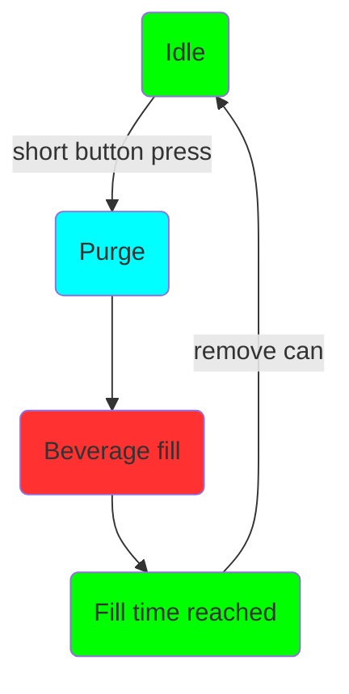
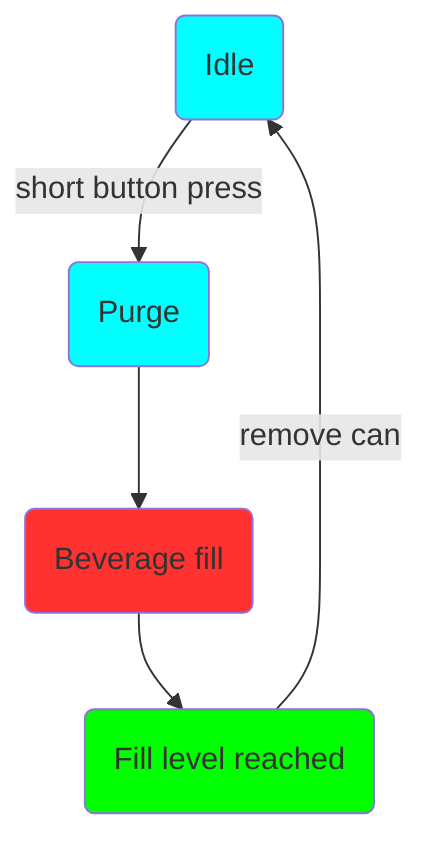

# Operation

The operation of the Mono and Duofiller is simple and intuitive. When the filler is idle give the corresponding push-button a short press to start a fill. The fill sequence will start with purge and then beverage fill. Any time during the fill sequence it can be stopped/aborted by a short press on the push button. 

A typical can-fill run:

I. Insert empty can, press button to start fill
II. Wait until filling stops
III. Remove the full can, insert a new empty can
IIII. Repeat.

A typical bottle-fill run:

I. Insert empty bottle, press button to start fill. Hold bottle in place by hand while filling
II. Move bottle downwards as it fills, keeping the fill-tube submerged only a few centimeters into the liquid. Wait until filling stops
III. Remove the full bottle, insert a new empty bottle
IIII. Repeat.

### Fill sequence

The fill sequence is started by pressing the button with a short press when the filler is idle in Timer Mode or Sensor Mode.

**Timer mode sequence and LED status:**

**Sensor mode sequence and LED status:**

The fill sequence can be aborted at any time by pressing the button a short press while the fill sequence is ongoing. In sensor mode the LED will be green until the can is removed.

To set the fill level setpoints we first go through the different modes:

### Timer Mode

Timer mode is indicated by a solid green light in the push-button when the filler is idle. Timer Mode fills the can for a defined time. Timer mode is very reliable and consistent, but it requires that the keg pressure is stable and the foam cap is consistent from can to can. We recommend using timer mode as the default mode for both carbonated and uncarbonated beverages. Timer mode can also be used to fill bottles. 

***Timer mode fill level programming***

To enter Timer Mode fill level programming first go to Timer Mode. Press the button and hold for 4-5 seconds. Release the button and the green light will start to blink which indicates that Timer Mode fill level programming is active. To set the fill level start a fill and stop it at the desired fill level. The fill level will be stored when the stop button is pressed. The led blinks 3x green. To go back to Timer Mode, press and hold the button for 4-5 seconds. The led will switch to solid green, indicating that it's back in Timer Mode.

Since Timer Mode measure the exact time used to fill to the desired fill level it's important to keep that in mind before the fill level is programmed. Set the keg pressure, flush/prime beverage tubing, etc. before Timer Mode programming.

### Sensor Mode

Sensor Mode is indicated by a solid blue light in the push-button when the filler is idle. Sensor Mode uses a pressure sensor to measure the fill level height. The pressure is measured in the CO~2~ tube. When the liquid level in the can increases the pressure in the CO~2~ tube will increase directly proportional to the liquid level in the can. 

Sensor Mode is recommended to be used if Timer Mode filling gives an inconsistent fill level. For example if inconsistent foaming or if you want to adjust pressure or flow rate while filling. Since the sensor measures hydrostatic pressure the height of the liquid the foam cap is almost neglected since the SG of the foam is very low compared to the liquid SG. That means the sensor measures the liquid height and not the liquid+foam height.

Sensor Mode can't be used to fill bottles because when the foam enters the narrow bottleneck it creates a small back pressure in the bottle, enough for the sensor to detect a false level reading. Also be aware that the large bubbles you often find in highly carbonated water, soda, and cider will make the sensor mode more inconsistent than using it with beer. Timer mode will work best for a carbonated beverage with large bubbles and high carbonation.

***Sensor mode fill level programming***

To enter sensor mode fill level programming first go to Sensor mode. Press the button and hold for 4-5 seconds. The blue light will start to blink which indicates that Sensor mode fill level programming is active. To set the fill level start a fill and stop it at the desired fill level. The fill level will be stored when the stop button is pressed. The led blinks 3X green and it automatically goes back to Sensor Mode. 

*Please note this difference; in Sensor Mode fill level programming it goes automatically back to Sensor Mode after successful level programming. In Timer Mode fill level programming it does not, the button has to be pressed for 4 seconds and released to go back to Timer Mode.*

The fill level will not be stored if the fill level is set at 25mm or less. If the fill level is not stored successfully it blinks red and stays in fill level program mode.

### Purge time programming

There's a third mode and it's used to program the purge time. Hold the push button for more than 6 seconds and release. LED will turn off, indicating that it's in purge time programming mode. When in purge time programming mode a short press on the button will skip the purge time +1 second forward. For each step, the led will blink red. When the purge time is 5 seconds the led will blink green instead of red. When at 10 seconds the next step will be 0 seconds. When at 0 seconds the led blinks blue (0 seconds = purge disabled). 

When at desired purge time, hold the button for more than 6 seconds and release. Purge time will be stored and you'll be back in the previously used mode.

Purge time is set globally for both Timer Mode and Sensor Mode. For Timer Mode purge can be disabled but for Sensor Mode, it's recommended to use at least 1 second purge time to ensure the CO~2~ tube is free of liquid before each fill sequence.

Default and factory set purge time are 6 seconds. The Purge time setting is stored in persistent memory.

### Firmware upgrade

The Duofiller has a Wifi AP which can be used to upload new firmware. To start the Wifi access point first un-power the filler. Hold the button while repowering the filler. On boot, the LED will start to toggle between red-green-blue. This indicates that the AP is started. Connect to the AP with password "duofiller". Go to address http://192.168.4.1 and upload the new firmware. Please never unplug the filler while the firmware upgrade is in progress. When the upgrade is complete it will be indicated by a solid green light in the led indication that it's back in Timer Mode. It's not necessary to reboot the filler after the firmware upgrade.

