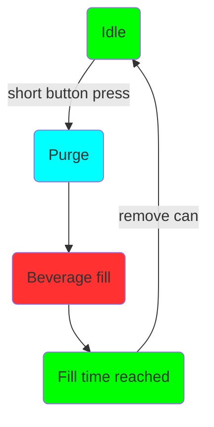
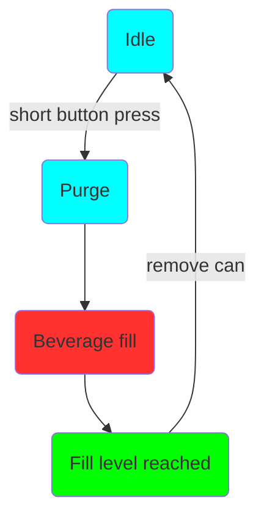

# Introduction

The new Duofiller generation 2 (G2) series is a can- and bottle filler that fills the cans or bottles to the desired fill level. The filling is done from a pressurized keg, unitank, barrel, etc. 

Currently, the series has two models, Mono and Duofiller. Mono is a single head filler while Duofiller is a dual head filler. Besides the fill-head count, they have equal functionality and they use software with equal functionality.

The filler has a two-step fill sequence; push the button and it first purges the can with CO~2~ before it starts to fill the beverage. The purge creates a blanket of CO~2~ on top of the liquid to minimize beverage air contact thus increasing the shelf life of the beverage. Beverage fill stops automatically when the desired fill level is reached.

They have electrical valves to control the CO~2~ flow and the beverage flow. The beverage valves are of "pinch" valve type, meaning it pinches a tube to close. When in open position the valve has a full bore, near-perfect flow path without any restrictions that can cause turbulence or foaming. It opens or closes the flexible tube by energizing the solenoid which retracts or attracts the plunger. This type of valve is ideal for sanitary applications because only the easily replaceable tubing contacts the flow media. Since the tube is full bore there are no narrow bore passes where particles can get stuck or cavities where particles settle out and that are difficult to clean.

The valve plunger can not be retracted by the solenoid alone, it requires the tube deflection and a minimum pressure in the beverage line (~0.5 bar) to open fully. After a long time without use, the first opening of the beverage valves may require more than 1-1.4 bar to assist the opening. When the valve is fully open there will be a loud click meaning it latches in fully open position. The valve is rated for 2.000.000 operations and the tube is rated for 500.000 operations. The tube is easily replaceable if it should get worn out.

### User Interface

The primary user interface for the Duofiller is each fill heads corresponding push button. Each button has a tri-color RGB LED for user feedback. The filling is started by a short button press. An ongoing fill sequence can be stopped or aborted at any time by pressing the same button once. Programming and menu navigation is done by timed button presses. 

It's also possible to edit parameters on the Duofillers webpage interface accessed by wifi. Wifi must be considered as a supplement as normally when using the Duofiller your hands are wet and it's not very practical to navigate on a touch screen or computer. But for some settings it might be more convenient to use the web interface, it's up to the user. Wifi is not a requirement for using the filler and wifi radio can aslo be disabled if desired.

 

 
 
 
 

 
 
 

### Operation modes

The Duofiller G2 series has two fill modes; Timer Mode and Sensor Mode. 

Sensor Mode uses a pressure sensor to measure the fill level height. The pressure is measured in the CO~2~ tube. When the liquid level in the can increases the pressure in the CO~2~ tube will increase directly proportional to the liquid level and basically ignoring the foam height. Sensor mode works best with beer. The large bubbles you often find in highly carbonated water, soda, and cider will make the sensor mode more inconsistent than if using it with beer.

Timer Mode fills the can for a defined time. Timer mode is very reliable and consistent, but it requires that the keg pressure is stable and the foam cap is consistent from can to can. We recommend using timer mode as the default mode for both carbonated and uncarbonated beverages. When filling bottles Timer Mode must be selcted as Sensor Mode will be unreliable due to backpressure in the bottle when foam exits the bottle neck. 

#### Operation

The operation of the Mono and Duofiller is simple and intuitive. When the filler is idle give the corresponding push-button a short press to start a fill. The fill sequence will start with purge and then beverage fill. Any time during the fill sequence it can be stopped/aborted by a short press on the push button. 

**A typical can-fill run:**

Set to Sensor Mode or Timer mode

I. Insert empty can, press button to start fill
II. Wait until filling stops
III. Remove the full can, insert a new empty can
IIII. Repeat.

**A typical bottle-fill run:**

Remove can holder bracket and set to Timer Mode.

I. Insert empty bottle, press button to start fill. Hold bottle in place by hand while filling
II. Move bottle downwards as it fills, keeping the fill-tube submerged only a few centimeters into the liquid. Wait until filling stops
III. Remove the full bottle, insert a new empty bottle
IIII. Repeat.

You want to move the bottle downwards as it fills. The reason is that you don't want the fill tubes to displace too much liquid. If the tubes are fully submerged in the bottle the level will drop when you remove the bottle from the tubes. By lowering the bottle while it fills the volume displaced by the fill tubes is kept at a minimum.

### Fill sequence

The fill sequence is started by pressing the button with a short press when the filler is idle in Timer Mode or Sensor Mode.

**Timer mode sequence and LED status:**

**Sensor mode sequence and LED status:**

The fill sequence can be aborted at any time by pressing the button a short press while the fill sequence is ongoing. 

