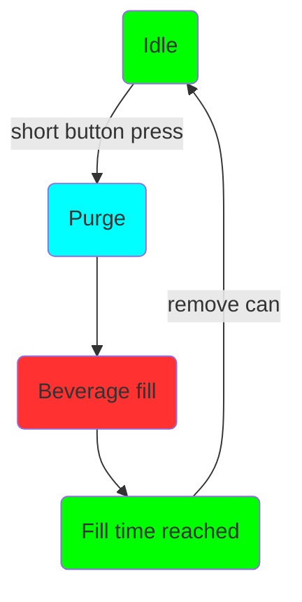
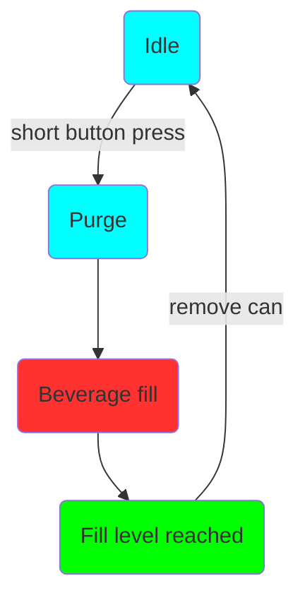

# Intro

Den nye Duofiller generasjon 2 (G2)-serien er en boks- og flaskefyller som fyller bokser eller flasker til ønsket fyllenivå. Fyllingen skjer fra et trykksatt fat, unitank, tank osv.

Serien har i dag to modeller, Mono og Duofiller. Mono er en fyller med ett fyllehode, mens Duofiller har to fyllehoder. Bortsett fra antall fyllehoder har modellene lik funksjonalitet og bruker programvare med samme funksjonalitet.

Duofiller har en to-stegs fyllesekvens: trykk på knappen, så purger den først boksen med CO~2~ før selve fyllingen starter. Purgingen lager et CO~2~-teppe over væsken som minimerer luftkontakt, og som dermed øker holdbarheten. Fyllingen stopper automatisk når ønsket fyllenivå er nådd.

Duofiller har elektriske ventiler som styrer CO~2~ og væskestrømmen. Fylleventilene er av typen pinchventil, det vil si at de klemmer sammen en slange for å stenge. I åpen stilling er slangen helt åpen — uten innsnevringer som kan skape turbulens eller skum. Ventilen åpner eller lukker den fleksible slangen ved at solenoiden får strøm og enten trekker tilbake eller drar til seg stempelet. Denne ventiltypen er ideell for sanitære anvendelser, fordi det kun er den lett utskiftbare slangen som er i kontakt med væsken. Siden slangen har full gjennomgang er det ingen trange passasjer der partikler kan sette seg fast, og ingen lommer der partikler kan samle seg og være vanskelige å rengjøre.

Ventilstempelet kan ikke trekkes tilbake av solenoiden alene — det trenger spensten i slangen pluss et minimumstrykk i fylleslangen (~0,5 bar) for å åpne helt. Etter lang tid uten bruk kan første åpning av fylleventilene kreve mer enn 1–1,4 bar for å hjelpe ventilen i gang. Når ventilen er helt åpen høres et tydelig klikk — det betyr at den har låst seg i full åpen stilling. Ventilen tåler 2 000 000 åpninger og slangen tåler 500 000 åpninger. Slangen er enkel å bytte hvis den blir slitt.
 

 

### Brukergrensesnitt

Det primære brukergrensesnittet for Duofiller er knappen til hvert fyllehode. Hver knapp har en trefarget RGB-LED for tilbakemelding til brukeren. Fyllingen startes med et kort knappetrykk. En pågående fyllesekvens kan stoppes eller avbrytes når som helst ved å trykke på samme knapp én gang. Programmering og menynavigering gjøres med tidsstyrte knappetrykk.

Det er også mulig å redigere parametere i Duofillers webgrensesnitt via wifi. Wifi må betraktes som et supplement — når du bruker Duofiller har du normalt våte hender, og det er ikke spesielt praktisk å navigere på en berøringsskjerm eller datamaskin. Men for enkelte innstillinger kan webgrensesnittet være mer hensiktsmessig — det er opp til brukeren. Wifi er ikke nødvendig for å bruke Duofiller, og wifi-radioen kan også deaktiveres om ønskelig.

 

 
 
 
 

 
 
 

### Driftsmoduser

Duofiller G2-serien har to moduser: Timermodus og Sensormodus.

Sensormodus bruker en trykksensor til å måle fyllenivåhøyden. Trykket måles i CO~2~-røret. Når væskenivået i boksen stiger, øker trykket i CO~2~-røret direkte proporsjonalt med væskenivået, mens skumhøyden i praksis ignoreres. Sensormodus fungerer best med øl. De store boblene man ofte finner i sterkt karbonert vann, brus og sider gjør Sensormodus mindre stabil enn med øl.

Timermodus fyller boksen i en definert tid. Timermodus er svært pålitelig og konsekvent, men krever at fattrykket er stabilt og at skumtoppen er konsistent fra boks til boks. Vi anbefaler Timermodus som standard for både karbonerte og ikke-karbonerte produkter. Ved fylling av flasker må Timermodus velges, fordi Sensormodus blir upålitelig på grunn av mottrykket som oppstår når skum presses ut av flaskehalsen.

#### Bruk

Bruken av Mono og Duofiller er enkel og intuitiv. Når Duofiller er inaktiv, gir du et kort trykk på den tilhørende knappen for å starte en fylling. Fyllesekvensen starter med purge og deretter selve fyllingen. Sekvensen kan stoppes/avbrytes når som helst med et kort trykk på knappen.

**Typisk boksefylling:**

Sett til Sensormodus eller Timermodus.

I. Sett inn tom boks, trykk på knappen for å starte fyllingen.
II. Vent til fyllingen stopper.
III. Fjern den fulle boksen og sett inn en ny tom boks.
IIII. Gjenta.

**Typisk flaskefylling:**

Fjern boksholder-braketten og sett til Timermodus.

I. Sett inn tom flaske, trykk på knappen for å starte fyllingen. Hold flasken på plass med hånden mens den fylles.
II. Senk flasken nedover etter hvert som den fylles, slik at fyllerøret er senket bare et par centimeter ned i væsken. Vent til fyllingen stopper.
III. Fjern den fulle flasken og sett inn en ny tom flaske.
IIII. Gjenta.

Du senker flasken nedover etter hvert som den fylles for at fyllerørene ikke skal fortrenge for mye væske. Hvis rørene står helt nedsenket i flasken vil nivået synke når du tar flasken ut. Ved å senke flasken mens den fylles holdes volumet som fortrenges av fyllerørene på et minimum.

### Fyllesekvens

Fyllesekvensen startes med et kort trykk på knappen når Duofiller er inaktiv i Timermodus eller Sensormodus.

**Timermodus-sekvens og LED-status:**

**Sensormodus-sekvens og LED-status:**

Fyllesekvensen kan avbrytes når som helst med et kort trykk på knappen mens den pågår.
