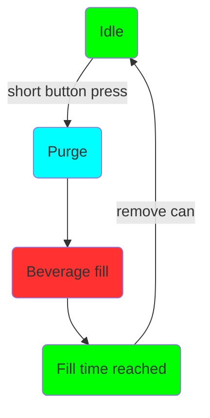
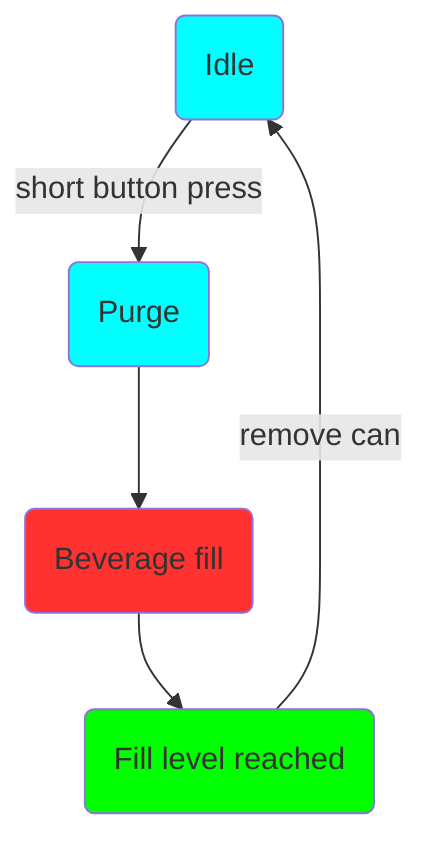

# Bruk

Bruken av Mono og Duofiller er enkel og intuitiv. Når boksfylleren er inaktiv, gir du et kort trykk på den tilhørende trykknappen for å starte en fylling. Fyllesekvensen starter med purge og deretter selve fyllingen. Sekvensen kan stoppes/avbrytes når som helst med et kort trykk på trykknappen.

Typisk boksefylling:

I. Sett inn tom boks, trykk på knappen for å starte fyllingen.
II. Vent til fyllingen stopper.
III. Fjern den fulle boksen og sett inn en ny tom boks.
IIII. Gjenta.

Typisk flaskefylling:

I. Sett inn tom flaske, trykk på knappen for å starte fyllingen. Hold flasken på plass med hånden mens den fylles.
II. Senk flasken nedover etter hvert som den fylles, slik at fyllerøret er senket bare et par centimeter ned i væsken. Vent til fyllingen stopper.
III. Fjern den fulle flasken og sett inn en ny tom flaske.
IIII. Gjenta.

### Fyllesekvens

Fyllesekvensen startes med et kort trykk på knappen når boksfylleren er inaktiv i Timermodus eller Sensormodus.

**Timermodus-sekvens og LED-status:**

**Sensormodus-sekvens og LED-status:**

Fyllesekvensen kan avbrytes når som helst med et kort trykk på knappen mens den pågår. I Sensormodus vil LED-en lyse grønt til boksen fjernes.

For å stille inn settpunktene, går vi først gjennom de ulike modusene:

### Timermodus

Timermodus indikeres med konstant grønt lys i trykknappen når boksfylleren er inaktiv. Timermodus fyller boksen i en definert tid. Timermodus er svært pålitelig og konsekvent, men krever at fattrykket er stabilt og at skumtoppen er konsistent fra boks til boks. Vi anbefaler Timermodus som standard for både karbonerte og ikke-karbonerte drikker. Timermodus kan også brukes til å fylle flasker.

***Programmering av fyllenivå i Timermodus***

For å gå inn i programmering av fyllenivå i Timermodus, gå først til Timermodus. Trykk og hold inne knappen i 4–5 sekunder. Slipp knappen, så begynner det grønne lyset å blinke — det indikerer at programmering av fyllenivå i Timermodus er aktiv. For å stille inn fyllenivået: start en fylling og stopp den ved ønsket fyllenivå. Fyllenivået lagres når stopp-knappen trykkes inn. LED-en blinker grønt 3 ganger. For å gå tilbake til Timermodus, trykk og hold inne knappen i 4–5 sekunder. LED-en skifter til konstant grønt, som indikerer at den er tilbake i Timermodus.

Siden Timermodus måler nøyaktig tiden som brukes til å fylle til ønsket fyllenivå, er det viktig å ha dette i bakhodet før fyllenivået programmeres. Sett fattrykket, skyll/fyll fylleslangene osv. før Timermodus-programmeringen.

### Sensormodus

Sensormodus indikeres med konstant blått lys i trykknappen når boksfylleren er inaktiv. Sensormodus bruker en trykksensor til å måle fyllenivåhøyden. Trykket måles i CO~2~-røret. Når væskenivået i boksen stiger, øker trykket i CO~2~-røret direkte proporsjonalt med væskenivået i boksen.

Sensormodus anbefales hvis Timermodus gir inkonsekvent fyllenivå. Eksempler er inkonsekvent skumdannelse, eller når du vil justere trykk eller flow underveis. Siden sensoren måler hydrostatisk trykk er skumtoppens høyde i praksis neglisjerbar — SG i skum er svært lav sammenlignet med SG i væsken. Det vil si at sensoren måler væskehøyden og ikke væske+skum-høyden.

Sensormodus kan ikke brukes til å fylle flasker. Når skum kommer inn i den trange flaskehalsen oppstår et lite mottrykk i flasken, nok til at sensoren registrerer en falsk nivåmåling. Vær også oppmerksom på at de store boblene man ofte finner i sterkt karbonert vann, brus og sider gjør Sensormodus mer inkonsekvent enn med øl. Timermodus fungerer best for sterkt karbonerte drikker med store bobler.

***Programmering av fyllenivå i Sensormodus***

For å gå inn i programmering av fyllenivå i Sensormodus, gå først til Sensormodus. Trykk og hold inne knappen i 4–5 sekunder. Det blå lyset begynner å blinke, som indikerer at programmering av fyllenivå i Sensormodus er aktiv. For å stille inn fyllenivået: start en fylling og stopp den ved ønsket fyllenivå. Fyllenivået lagres når stopp-knappen trykkes inn. LED-en blinker grønt 3 ganger, og den går automatisk tilbake til Sensormodus.

*Merk denne forskjellen: i Sensormodus-programmering går boksfylleren automatisk tilbake til Sensormodus etter vellykket programmering. I Timermodus-programmering gjør den ikke det — knappen må holdes inne i 4–5 sekunder og slippes for å gå tilbake til Timermodus.*

Fyllenivået lagres ikke hvis det er satt til 25 mm eller mindre. Hvis fyllenivået ikke blir lagret, blinker LED-en rødt og forblir i programmeringsmodus.

### Programmering av purgetid

Det finnes en tredje modus som brukes til å programmere purgetiden. Hold inne trykknappen i mer enn 6 sekunder og slipp. LED-en slukker, som indikerer at den er i programmeringsmodus for purgetid. I denne modusen øker hvert korte trykk på knappen purgetiden med +1 sekund. For hvert steg blinker LED-en rødt. Når purgetiden er 5 sekunder blinker LED-en grønt i stedet for rødt. Når den står på 10 sekunder vil neste steg være 0 sekunder. Ved 0 sekunder blinker LED-en blått (0 sekunder = purge deaktivert).

Når ønsket purgetid er valgt: hold inne knappen i mer enn 6 sekunder og slipp. Purgetiden lagres, og du er tilbake i tidligere brukte modus.

Purgetid er satt globalt for både Timermodus og Sensormodus. For Timermodus kan purge deaktiveres, men for Sensormodus anbefales minst 1 sekunds purgetid for å sikre at CO~2~-røret er fri for væske før hver fyllesekvens.

Standard og fabrikkinnstilt purgetid er 6 sekunder. Innstillingen for purgetid lagres i permanent minne.

### Firmwareoppgradering

Duofiller har et wifi-aksesspunkt (AP) som kan brukes til å laste opp ny firmware. For å starte AP-en, koble først boksfylleren fra strøm. Hold inne knappen mens du kobler til strøm igjen. Ved oppstart vil LED-en begynne å veksle mellom rød–grønn–blå. Det indikerer at AP-en er startet. Koble til AP-en med passord "duofiller". Gå til http://192.168.4.1 og last opp den nye firmware-filen. Koble aldri fra boksfylleren mens oppgraderingen pågår. Når oppgraderingen er ferdig indikeres dette med konstant grønt lys i LED-en — boksfylleren er tilbake i Timermodus. Det er ikke nødvendig å starte boksfylleren på nytt etter oppgraderingen.

