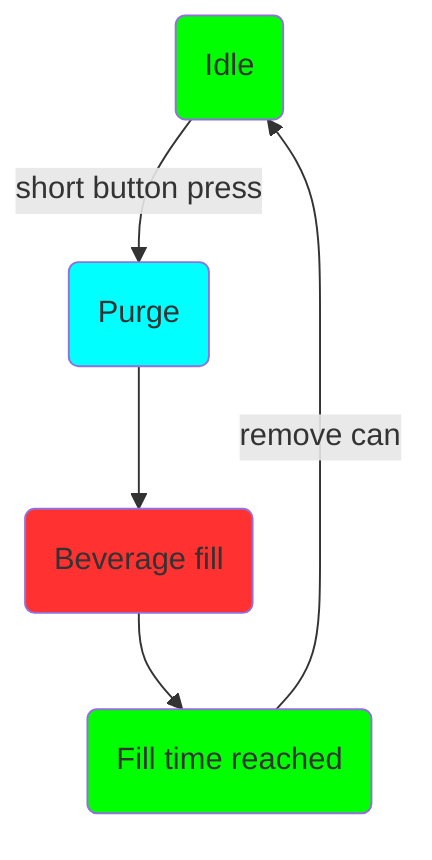
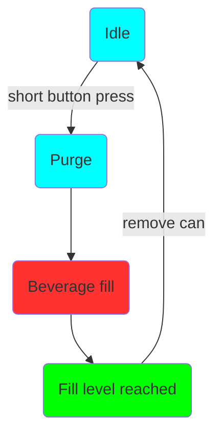

# Bruk

Betjeningen av Mono- og Duofiller er enkel og intuitiv. Når fylleren er inaktiv, trykker du kort på den tilsvarende trykknappen for å starte en fylling. Fyllingssekvensen starter med tømming og deretter drikkefylling. Når som helst under påfyillingssekvensen kan den stoppes eller avbrytes ved et kort trykk på trykknappen.

Typisk fylling av boks:

I. Sett inn en tom boks, og trykk på knappen for å starte fyllingen
II. Vent til fyllingen stopper
III. Fjern boksen når den er full, og sett inn en tom boks
IIII. Gjenta.

Typisk fylling av flaske:

I. Sett inn en tom flaske, og press på knappen for å starte fyllingen
II. Flytt flasken nedover mens den fylles, slik at fyllerøret er et par centimeter under væskenivået i flasken
III. Flytt flasken når den er full, og sett inn en ny tom flaske
IIII. Gjenta.

### Fyllingssekvens

Fyllesekvensen starter ved å trykke på knappen med et kort trykk når fylleren er i Timer- eller Sensormodus. 

**Timermodus med LED-status:**

**Sensormodus med LED-status:**

Fyllesekvensen kan avbrytes når som helst ved å trykke på knappen mens fyllesekvensen pågår. I sensormodus vil lysdioden lyse grønt til boksen fjernes. 

For å stille inn fyllnivået går vi først gjennom den forskjellige modusen:

### Timermodus

Timermodus indikeres med et kostant grønt lys i trykknappen når påfyllingen er inaktiv. Timermodus fyller boksen i en definert tid. Timermodus er veldig pålitelig og konsekvent, men det krever at fattrykket er stabilt og skumlokket er konsistent fra boks til boks. Vi anbefaler å bruke timermodus som standardmodus for både kullsyreholdige og ukullsyreholdige drikker. Timermodus kan også brukes til å fylle flasker. 

***Timermodusprogrammering***

For å gå inn i timermodusprogrammering, må du først gå til timermodus. Trykk på knappen og hold den inne i 4-5 sekunder. SLipp knappen og det grønne lyset vil begynne å blinke, noe som indikerer at programmering av timermodus er aktiv. For å stille inn fyllingsnivået må du starte en fylling og stoppe den ved ønsket fyllingsnivå. Fyllingsnivået lagres når stoppknappen trykkes inn. Lysdioden blinker 3x grønt. For å gå tilbake til timermodus, trykk og hold knappen i 4-5 sekunder. Lysdioden vil bytte til konstant grønt, noe som indikerer at den er tilbake i timermodus. 

Siden timermodus måler den nøyaktige tiden som brukes til å fylle til ønsket fyllingsnivå, er det viktig å ha det i bakhodet før fyllingsnivået programmeres. Still inn fattrykket, spyle drikkeslanger osv. før programmering av timermodus.

### Sensormodus

Sensormodus indikeres med et konstant blått lys i trykknappen når påfyllingen er inaktiv. Sensormodus bruker en trykksensor for å måle fyllingsnivåhøyden. Trykket måles i CO2-røret. Når væskenivået i boksen øker, vil trykket i CO2 røret øke direkte proporsjonalt med væskenivået i boksen.  

Sensormodus anbefales brukt hvis timermodusfylling gir et inkosekvent fyllingsnivå. For eksempel ved inkosekvent skumdannelse eller hvis du ønsker å justere trykk eller strømningshastighet mens du fyller. Siden sensoren måler hydrostatisk trykk, er høyden på væsken nesten neglisjert, siden SG av skum er svært lav sammenlignet med flytende SG. Det betyr at sensoren måler væskehøyden og ikke væske+skumhøyden. 

Sensormodus kan ikke brukes til å fylle flasker fordi skummet kommer inn i den trange flaskehalsen, som skaper mottrykk i flasken, som er nok til at sensoren oppdager en falsk nivåavlesning. Vær også oppmerksom på at de store boblene du ofte finner i høyt kullsyreholdig vann, brus, og cider vil gjøre sensormodusen mer inkonsekvent enn å bruke den med øl. Timermodusen vil fungere best for enb kullsyreholdig drikk med store bobler og høy kullsyre. 

***Sensormodusprogrammering***

For å gå inn i sensormodusprogrammering går du først til sensormodus. Trykk på knappen og hold den inne i 4-5 sekunder. Det blå lyset vil begynne å blinke, noe som indikerer at programmering av fyllnivå i sensormodus er aktiv. For å stille inn fyllingsnivået, start en fylling og stopp den ved ønsket fyllingsnivå. Fyllingsnivået lagres når stoppknappen trykkes inn. Lysdioden blinker 3X grønt og den går automatisk tilbake til sensormodus.  

*Vær oppmerksom på denne forskjellen; i sensormodusprogrammering går den automatisk tilbake til sensormodus etter vellykket nivåprogrammering. I timermodusprogrammering gjør den ikke det, og knappen må holdes inne i 4 sekunder og slippes for å gå tilbake til denne modusen.*

Fyllingsnivået vil ikke bli lagret hvis fyllnivået er satt til 25mm eller mindre. Hvis fyllnivået ikke lagres på riktig måte, blinker det rødt og forblir i programmodus for fyllnivå.

### Programmering av purgetid

Det er en tredje modus og den brukes til å programmere purgetiden. Hold trykknappen inne i mer enn 6 sekunder og slipp. LED-lyset vil slå seg av, noe som indikerer at den er i programmeringsmodus for purgetid. Da vil et kort trykk på knappen øke tiden med +1 sekund fremover. For hvert trinn vil lysdioden blinke rødt. Når purgetiden er 5 sekunder vil lysdioden blinke grønt i stedet for rødt. Når du kommer til 10 sekunder vil neste trinn være 0 sekunder. Når den står på 0 sekunder blinker lysdioden blått (0 sekunder = purging deaktivert). 

Når du har satt din ønskede purgetid, kan du holde knappen inne i mer enn 6 sekunder og slippe. Purgetiden vil bli lagret, og du vil være tilbake i den tidligere brukte modusen. 

Purgetid er satt globalt for både timermodus og sensormodus. For timermodus kan rensing deaktiveres, men for sensormodus anbefales det å bruke minst 1 sekunds purgetid for å sikre at CO2-røret er fri for væske før hver fyllingssekvens.

Standard og fabrikkinnstilt purgetid er 6 sekunder. Innstillingen for purgetid lagres i minnet. 

