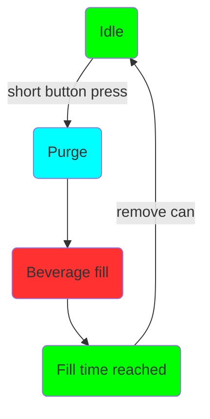
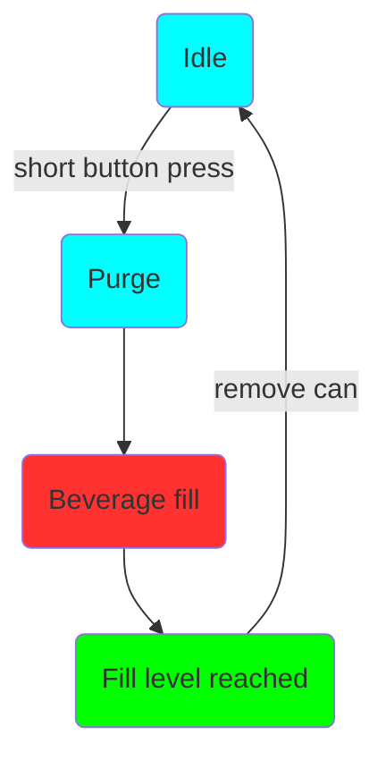

# Intro

Den nye Duofiller generasjonen 2 (G2) serien er en boks- og flaskefyller som fyller til det ønskede fyllenivået. Fylling blir gjort fra et fat, unitank, tønne etc med trykk. 

G2 er en serie med to modeller; Mono og Duofiller. Mono er en fyller med singlehode, mens Duofiller er en med doble fyllehoder. Utenom antall fyllehoder er disse produktene og deres software av samme funksjon.

Fylleren har to-stegs fyllesekvens; trykk på knappen og den purger først kannen med CO2, fører den begynner å fylle væske. Purgingen lager en pute med CO2 på toppen av væsken, for å minimere luftkontakt for væsken, som igjen øker holdbarheten til drikkevaren. Mengden med væske stopper automatisk når ønsket fyllenivå er nådd.

De har elektriske ventiler som kontrollerer CO2 og væskefylling. Fylleventilene er av typen pinch-ventil, som betyr at de klemmer på slangen for å stenge av. Når den er i åpen posisjon har den full gjennomstrømming, med nær perfekt strømning uten noen restriksjoner som kan forårsake turbulens eller skumming. Den åpner eller lukker den fleksible tuben ved å aktivere solenoiden som trekker tilbake eller trekker til seg stempelet. Denne typen ventil er ideel for sanitære applikasjoner fordi kun den lett erstattelige slangen er den eneste som er i kontakt med drikkevaren. Siden slangen er helt åpen er det ingen trange passasjer hvor partikler kan bli sittende fast, og som er vanskelig å rengjøre.

Ventilen kan ikke bli åpnet av den elektriske solenoiden alene, den trenger hjelp av spensten i slangen og et minimumstrykk i slangen (0,5bar) for å åpne seg helt. Etter en lang stund uten å bli brukt vil det kunne kreves mer trykk (1-1,4bar) for å åpne den. Når ventilen er helt åpener vil du høre et høyt klikk. 
 

 
### User Interface

Primært brukergrensesnitt for Duofiller er trykkknappene. Hver knapp har en trefarget RGB LED for tilbakemelding til brukeren. Fyllingen startes med et kort knappetrkk. En pågående fyllesekvens kan stoppes eller avbrytes når som helst ved å trykke én gang på den samme knappen. Programmering og menynavigering gjørs ved tidsstyrte knappetrykk.  

Det er også mulig å redigere parametere på Duofillers webinterface som er tilgjengelig via wifi. Wifi må betraktes som et supplement, siden normalt når du bruker Duofiller er hendene våte er det ikke praktisk å navigere på en berøringsskjerm eller datamaskin. Men for noen innstillinger kan det være mer praktisk å bruke webinterfacet, men dette er opp til brukeren selv. Wifi er ikke et krav for bruk av filleren og wifiradio kan også deaktiveres om ønskelig.

 

 
 
 
 

 
 
 

### Operation modes

Duofilleren G2 serien har to fyllemoduser; Timermodus og Sensormodus. 

Sensormodus bruker trykksensor for å måle fyllingens høyde. Trykket måles med CO2-røret. Når væskenivået i boksen øker, vil trykket i CO2-røret øke proposjonalt med væskenivået og i utgangspunktet ignorere skumhøyden. Sensormodus fungerer best med øl. De store boblene du ofte finner i høyt kullsyreholdig vann, brus, og cider vil gjøre sensormodusen mer unøyaktig enn om du bruker den med øl.

Timermodus fyller boksen i en definert tid. Timermodus er veldig pålitelig og konsekvent, men det krever at fattrykket er stabilt og skummet er konsistent fra boks til boks. Vi anbefaler å bruker timermodus som standardmodus for både kullsyre- og ikke kullsyreholdige drikker. Ved fylling av flasker må timermodus velges, da sensormodus vil være upålitelig på grunn av mottrykk i flasken når skum kommer ut av flaskehalsen.

#### Bruk

Bruken av Mono og Duofiller er enkelt og intuitivt. Når fylleren er inaktiv, trykker du kort på den tilsvarende trykknappen for å starte en fylling. Fyllingssekvensen starter med CO2 purging og deretter fylling. Når som helst under fyllesekvensen kan den stoppes eller avbrytes ved et kort trykk på trykknappen.

**En typisk fylling av boks:**

Still inn på sensor- eller Timermodus

I. Sett inn tom boks, trykk på knappen for å starte fylling
II. Vent til fylling stopper
III. Fjern den fulle boksen, og sett inn en ny tom boks
IIII. Gjenta.

**En typisk flaskefylling:**

Fjern bokseholderen og sett til timermodus.

I. Sett inn en tom flaske, trykk på knappen for å starte fylling. Hold flasken på plass med hånden når du fyller
II. Flytt flasken nedover mens den fylles, med fyllingsrøret bare få centimer under væsken. Vent til fyllingen stopper
III. Fjern den fulle flasken og sett inn en ny tom flaske
IIII. Gjenta.

Du ønsker å flytte flasken nedover mens den fylles. Grunnen er at du ikke vil at påfyllingsrørene skal fortrenge for mye væske. Hvis rørene er helt nedsenket i flasken, vil nivået synke når du fjerner flasken fra rørene. Ved å senke flasken mens den fylles, holdes volumet som fortrenges av påfyllingsrørene på et minimum. 

### Fyllesekvens

Fyllesekvensen starter ved gi knappen et kort trykk når fylleren står på Timer- eller sensormodus.

**Timermodussekvens og LED-status:**

**Sensormodus med sekvens og LED-status:**

Man kan stoppe fyllsekvensen når som helst ved å trykke på knappen mens fyllingen pågår. 
