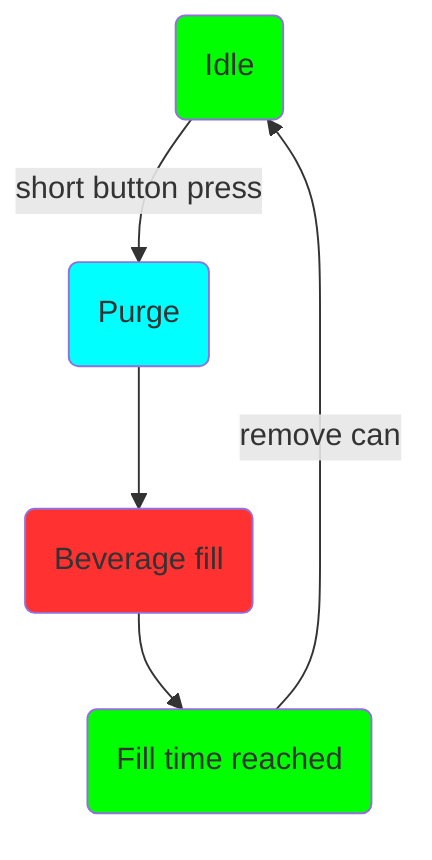
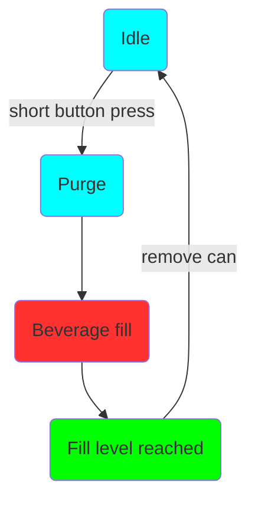

# Introducción

La nueva serie Duofiller generación 2 (G2) es una llenadora de latas y botellas que llena hasta el nivel de llenado deseado. El llenado se realiza desde un barril presurizado, unitank, bidón, etc.

Actualmente, la serie cuenta con dos modelos, Mono y Duofiller. Mono es una llenadora de cabezal único, mientras que Duofiller es una llenadora de cabezal doble. Además del recuento de cabezas de llenado, tienen la misma funcionalidad y utilizan software con la misma funcionalidad.

El llenador tiene una secuencia de llenado de dos pasos; presione el botón y primero purga la lata con CO~2~ antes de comenzar a llenar la bebida. La purga crea una capa de CO~2~ sobre el líquido para minimizar el contacto de la bebida con el aire, lo que aumenta la vida útil de la bebida. El llenado se detiene automáticamente cuando se alcanza el nivel de llenado deseado.

Tiene válvulas eléctricas para controlar el flujo de CO~2~ y el flujo de bebida. Las válvulas de bebida son del tipo "pellizco", lo que significa que aprieta un tubo para cerrarlo. Cuando está en posición abierta, la válvula tiene un paso total, una trayectoria de flujo casi perfecta sin ninguna restricción que pueda causar turbulencia o formación de espuma. Abre o cierra el tubo flexible energizando el solenoide que retrae o atrae el émbolo. Este tipo de válvula es ideal para aplicaciones sanitarias porque solo la tubería fácilmente reemplazable entra en contacto con el medio de flujo. Dado que el tubo es de paso total, no hay pasos de paso estrecho donde las partículas puedan atascarse o cavidades donde las partículas se asienten y que sean difíciles de limpiar.

El émbolo de la válvula no se puede retraer solo con el solenoide, requiere la deflexión del tubo y una presión mínima en la línea de bebida (~0.5 bar) para abrirse por completo. Después de mucho tiempo sin uso, la primera apertura de las válvulas de bebida puede requerir más de 1-1,4 bar para ayudar a la apertura. Cuando la válvula esté completamente abierta, se escuchará un fuerte clic, lo que significa que se trabará en la posición completamente abierta. La válvula tiene capacidad para 2.000.000 de operaciones y el tubo para 500.000 operaciones. El tubo es fácilmente reemplazable si se desgasta.
 

 
### Interfaz de usuario

La interfaz de usuario principal de Duofiller es el botón pulsador correspondiente de cada cabezal de llenado. Cada botón tiene un LED RGB tricolor para la retroalimentación del usuario. El llenado se inicia con una breve pulsación del botón. Una secuencia de llenado en curso se puede detener o cancelar en cualquier momento presionando el mismo botón una vez. La programación y la navegación por los menús se realizan mediante pulsaciones cronometradas del botón.

También es posible editar parámetros en la interfaz de la página web de Duofillers a la que se accede por wifi. El Wifi debe ser considerado como un complemento, ya que normalmente cuando se utiliza el Duofiller las manos están mojadas y no es muy práctico navegar en una pantalla táctil u ordenador. Pero para algunas configuraciones puede ser más conveniente usar la interfaz web, depende del usuario. El wifi no es un requisito para usar la llenadora y el wifi también puede desactivarse si se desea.

 

 
 
 
 

 
 
 

### Modos de operación

La serie Duofiller G2 tiene dos modos de llenado; Modo de temporizador y modo de sensor.

El modo de sensor utiliza un sensor de presión para medir la altura del nivel de llenado. La presión se mide en el tubo de CO~2~. Cuando el nivel de líquido en la lata aumenta, la presión en el tubo de CO~2~ aumentará directamente proporcional al nivel de líquido y básicamente ignorando la altura de la espuma. El modo sensor funciona mejor con cerveza. Las burbujas grandes que a menudo se encuentran en el agua altamente carbonatada, los refrescos y la sidra harán que el modo del sensor sea más inconsistente que si se usa con cerveza.

El modo de temporizador llena la lata durante un tiempo definido. El modo de temporizador es muy confiable y consistente, pero requiere que la presión del barril sea estable y que la tapa de espuma sea consistente de lata a lata. Recomendamos usar el modo de temporizador como el modo predeterminado para bebidas carbonatadas y no carbonatadas. Cuando se llenan botellas, se debe seleccionar el modo de temporizador, ya que el modo de sensor no será confiable debido a la contrapresión en la botella cuando la espuma sale del cuello de la misma.

#### Operación

El funcionamiento del Mono y Duofiller es sencillo e intuitivo. Cuando el llenador esté inactivo, presione brevemente el botón correspondiente para iniciar un llenado. La secuencia de llenado comenzará con la purga y luego el llenado de bebidas. En cualquier momento durante la secuencia de llenado, se puede detener/abortar presionando brevemente el botón.

**Una ejecución típica de llenado de latas:**

Establezca el modo de sensor o de temporizador

I. Inserte la lata vacía, presione el botón para comenzar a llenar
II. Espere hasta que se detenga el llenado
III. Retire la lata llena, inserte una nueva lata vacía
IIII. Repetir

**Una ejecución típica de llenado de botellas:**

Retire el soporte porta latas y configúrelo en el modo de temporizador.

I. Inserte la botella vacía, presione el botón para comenzar a llenar. Sostenga la botella en su lugar con la mano mientras la llena
II. Mueva la botella hacia abajo a medida que se llena, manteniendo el tubo de llenado sumergido solo unos centímetros en el líquido. Espere hasta que se detenga el llenado
III. Retire la botella llena, inserte una nueva botella vacía
IIII. Repetir.

Se trata de mover la botella hacia abajo a medida que se llena. La razón es que no quieres que los tubos de llenado desplacen demasiado líquido. Si los tubos están completamente sumergidos en la botella, el nivel bajará cuando retire la botella de los tubos. Al bajar la botella mientras se llena, el volumen desplazado por los tubos de llenado se mantiene al mínimo.

### Secuencia de llenado

La secuencia de llenado se inicia presionando el botón con una pulsación corta cuando el llenador está inactivo en el modo de temporizador o el modo de sensor.

**Secuencia en modo temporizador y estado del led:**

**Secuencia en modo sensor y estado del led:**

La secuencia de llenado se puede cancelar en cualquier momento presionando brevemente el botón mientras la secuencia está en curso.
