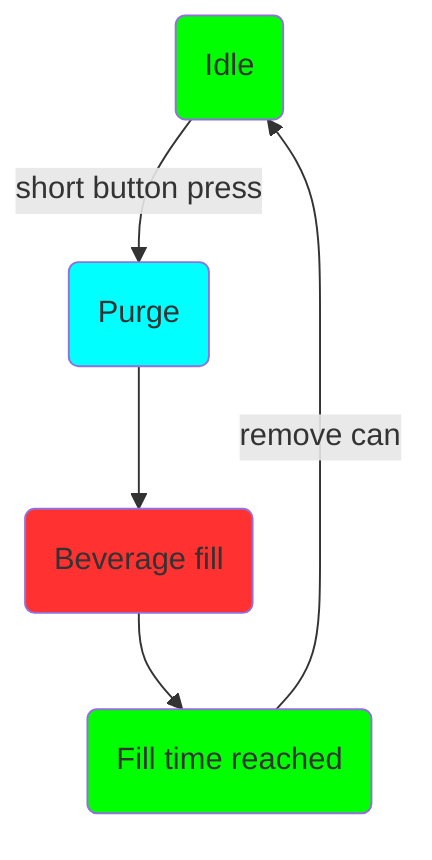
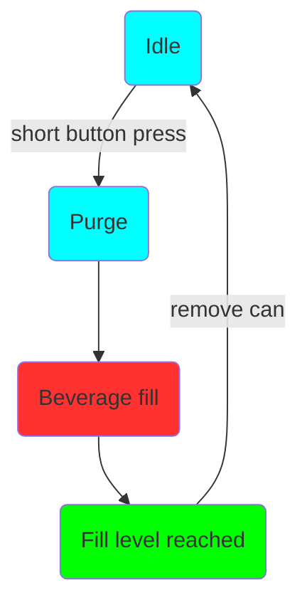

# Operación

El funcionamiento de Mono y Duofiller es sencillo e intuitivo. Cuando la llenadora esté inactiva, presione brevemente el botón correspondiente para iniciar un llenado. La secuencia de llenado comenzará con la purga y luego el llenado de la bebida. En cualquier momento durante la secuencia de llenado, se puede detener o abortar presionando brevemente el botón.

Una ejecución típica de llenado de latas:

I. Inserte la lata vacía, presione el botón para comenzar a llenar
II. Espere hasta que se detenga el llenado
III. Retire la lata llena, inserte una nueva lata vacía
IIII. Repetir

Una ejecución típica de llenado de botellas:

I. Inserte la botella vacía, presione el botón para comenzar a llenar. Sostenga la botella en su lugar con la mano mientras la llena
II. Mueva la botella hacia abajo a medida que se llena, manteniendo el tubo de llenado sumergido solo unos centímetros en el líquido. Espere hasta que se detenga el llenado
III. Retire la botella llena, inserte una nueva botella vacía
IIII. Repetir.

### Secuencia de llenado

La secuencia de llenado se inicia presionando el botón con una pulsación corta cuando la llenadora está inactiva en Modo Temporizador o Modo Sensor.

**Secuencia en Modo Temporizador y estado del LED:**

**Secuencia en Modo Sensor y estado del LED:**

La secuencia de llenado se puede cancelar en cualquier momento presionando brevemente el botón mientras la secuencia está en curso. En Modo Sensor, el LED estará verde hasta que se retire la lata.

Para configurar los puntos de ajuste del nivel de llenado, primero repasemos los diferentes modos:

### Modo Temporizador

El Modo Temporizador se indica con una luz verde fija en el botón cuando la llenadora está inactiva. El Modo Temporizador llena la lata durante un tiempo definido. Este modo es muy confiable y consistente, pero requiere que la presión del barril sea estable y que la tapa de espuma sea consistente de lata a lata. Recomendamos usar el Modo Temporizador como el modo predeterminado para bebidas carbonatadas y no carbonatadas. El Modo Temporizador también se puede utilizar para llenar botellas.

***Programación de nivel de llenado en Modo Temporizador***

Para ingresar a la programación del nivel de llenado del Modo Temporizador, primero vaya al Modo Temporizador. Presione el botón y manténgalo presionado durante 4–5 segundos. Suelte el botón y la luz verde comenzará a parpadear, lo que indica que la programación del nivel de llenado en Modo Temporizador está activa. Para establecer el nivel de llenado, inicie un llenado y deténgalo en el nivel deseado. El nivel de llenado se almacenará cuando se presione el botón de parada. El LED parpadea 3 veces en verde. Para volver al Modo Temporizador, mantenga presionado el botón durante 4–5 segundos. El LED cambiará a verde fijo, lo que indica que está de vuelta en el Modo Temporizador.

Dado que el Modo Temporizador mide el tiempo exacto utilizado para llenar hasta el nivel de llenado deseado, es importante tenerlo en cuenta antes de programar el nivel de llenado. Establezca la presión del barril, enjuague o cebe la línea de llenado, etc. antes de programar el Modo Temporizador.

### Modo Sensor

El Modo Sensor se indica mediante una luz azul fija en el botón cuando la llenadora está inactiva. El Modo Sensor utiliza un sensor de presión para medir la altura del nivel de llenado. La presión se mide en el tubo de CO~2~. Cuando el nivel de líquido en la lata aumenta, la presión en el tubo de CO~2~ aumentará directamente proporcional al nivel de líquido en la lata.

Se recomienda usar el Modo Sensor si el llenado en Modo Temporizador da un nivel de llenado inconsistente. Por ejemplo, si la formación de espuma es inconsistente o si desea ajustar la presión o el caudal durante el llenado. Dado que el sensor mide la presión hidrostática, la altura de la capa de espuma casi se ignora, ya que la SG de la espuma es muy baja en comparación con la SG del líquido. Eso significa que el sensor mide la altura del líquido y no la altura del líquido + espuma.

El Modo Sensor no se puede usar para llenar botellas porque cuando la espuma entra en el estrecho cuello de la botella crea una pequeña contrapresión suficiente para que el sensor detecte una lectura de nivel falsa. También tenga en cuenta que las burbujas grandes que a menudo encuentra en el agua altamente carbonatada, los refrescos y la sidra harán que el Modo Sensor sea más inconsistente que usarlo con cerveza. El Modo Temporizador funcionará mejor para una bebida carbonatada con burbujas grandes y alta carbonatación.

***Programación de nivel de llenado en Modo Sensor***

Para ingresar a la programación del nivel de llenado del Modo Sensor, primero vaya al Modo Sensor. Presione el botón y manténgalo presionado durante 4–5 segundos. La luz azul comenzará a parpadear, lo que indica que la programación del nivel de llenado en Modo Sensor está activa. Para establecer el nivel de llenado, inicie un llenado y deténgalo en el nivel deseado. El nivel de llenado se almacenará cuando se presione el botón de parada. El LED parpadea 3 veces en verde y automáticamente vuelve al Modo Sensor.

*Por favor tenga en cuenta esta diferencia: en la programación del nivel de llenado en Modo Sensor, regresa automáticamente al Modo Sensor después de una programación exitosa. En la programación del nivel de llenado en Modo Temporizador no es así; el botón debe presionarse durante 4–5 segundos y soltarse para volver al Modo Temporizador.*

El nivel de llenado no se almacenará si el nivel de llenado se establece en 25 mm o menos. Si el nivel de llenado no se almacena correctamente, parpadea en rojo y permanece en el modo de programación de nivel de llenado.

### Programación del tiempo de purga

Existe un tercer modo y se utiliza para programar el tiempo de purga. Mantenga presionado el botón durante más de 6 segundos y suéltelo. El LED se apagará, indicando que está en modo de programación de tiempo de purga. En este modo una pulsación corta del botón incrementará el tiempo de purga en +1 segundo. Para cada paso, el LED parpadeará en rojo. Cuando el tiempo de purga sea de 5 segundos, el LED parpadeará en verde en lugar de rojo. Cuando esté en 10 segundos el siguiente paso será 0 segundos. Cuando está a 0 segundos el LED parpadea en azul (0 segundos = purga desactivada).

Cuando llegue al tiempo de purga deseado, mantenga presionado el botón durante más de 6 segundos y suéltelo. El tiempo de purga se almacenará y volverá al modo utilizado anteriormente.

El tiempo de purga se establece globalmente tanto para el Modo Temporizador como para el Modo Sensor. Para el Modo Temporizador, la purga se puede desactivar, pero para el Modo Sensor, se recomienda usar al menos 1 segundo de tiempo de purga para asegurarse de que el tubo de CO~2~ esté libre de líquido antes de cada secuencia de llenado.

El tiempo de purga predeterminado y configurado de fábrica es de 6 segundos. La configuración del tiempo de purga se almacena en la memoria persistente.

### Actualización del firmware

El Duofiller tiene un AP Wifi que se puede usar para cargar nuevo firmware. Para iniciar el punto de acceso Wifi, primero apague la llenadora. Mantenga presionado el botón mientras vuelve a conectar la llenadora a la corriente. En el arranque, el LED comenzará a alternar entre rojo, verde y azul. Esto indica que el AP está iniciado. Conéctese al AP con la contraseña "duofiller". Vaya a la dirección http://192.168.4.1 y cargue el nuevo firmware. Nunca desconecte la llenadora mientras la actualización del firmware está en curso. Cuando se complete la actualización, se indicará con una luz verde fija en el LED que indica que está nuevamente en el Modo Temporizador. No es necesario reiniciar la llenadora después de la actualización del firmware.

